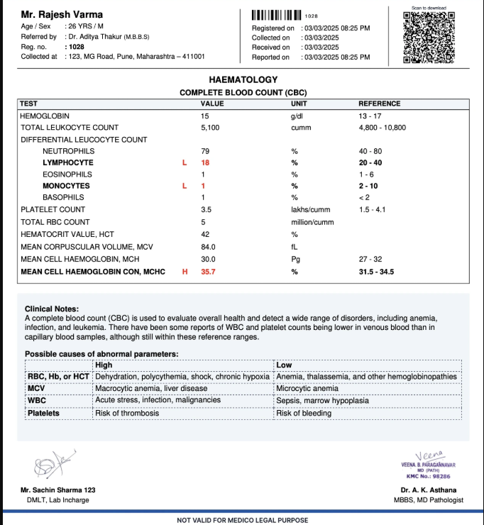
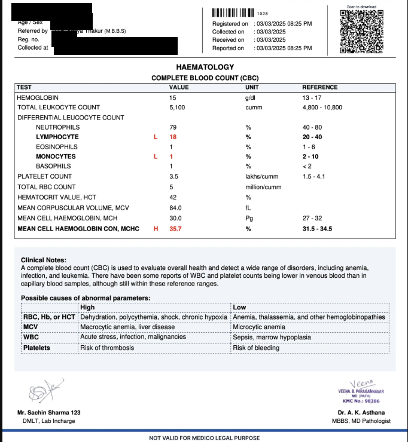
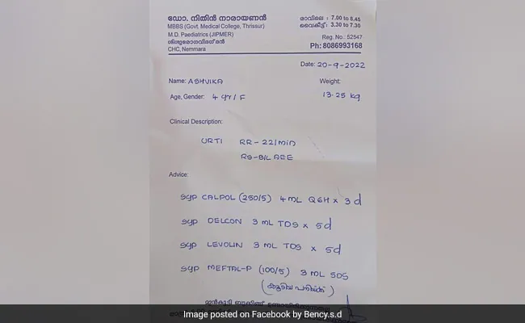
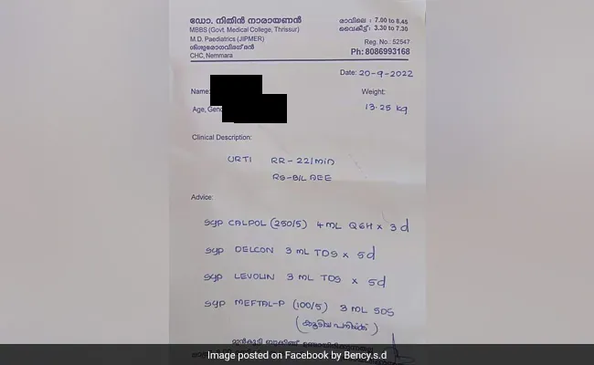
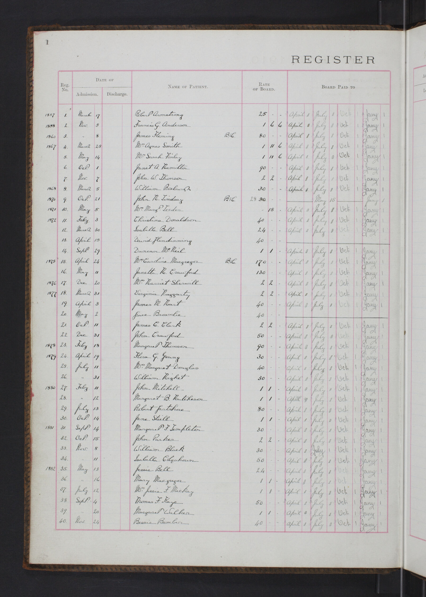
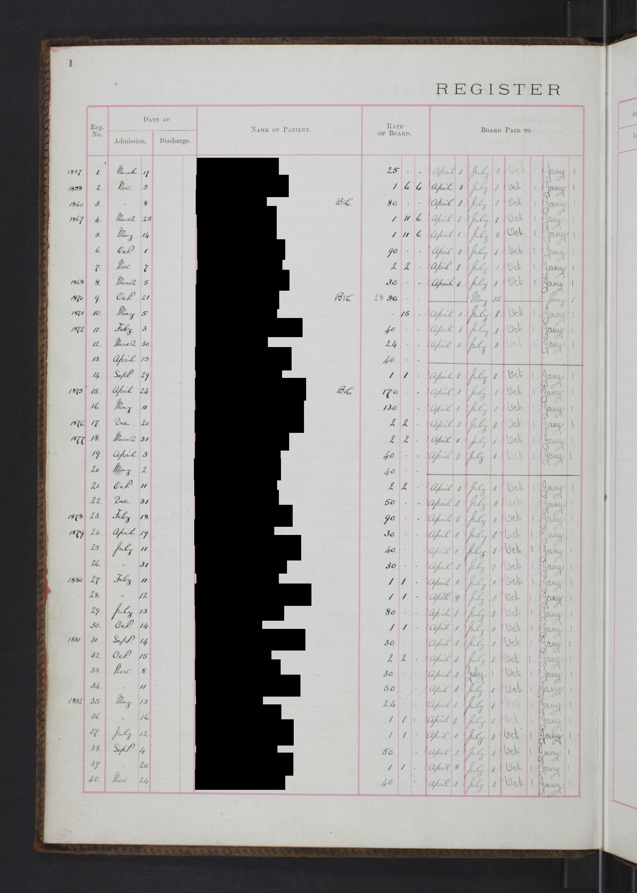

# Medical Record Privacy Redaction

**Identify and cover patient information locally while preserving useful diagnoses, laboratory results, and treatment details.**

[简体中文](README.md) | English

This is a local privacy-redaction Skill for laboratory sheets, pathology reports, examination reports, prescriptions, and other text- or table-heavy medical documents. Text recognition, privacy decisions, irreversible masking, and output checks can all run on the device or private network. Originals remain unchanged, and source images, OCR text, and patient information do not need to enter a public OCR service or cloud language model.

> This project is not a privacy certification, legal advice, or a guarantee of complete anonymity. Every document requires a final human review before external release.

## English before-and-after cases

The comparisons below cover a standard report, a photographed prescription, and structured handwriting. Each source contains visible patient information, and the tables show what was covered, what remained readable, and what still requires review. Chinese examples are available in the [Chinese README](README.md).

### Standard report: modern complete blood count

This modern CBC report visibly contains a patient name, age and sex, registration number, street address, barcode, and QR code. The project covered the text identity fields while preserving the test table, values, reference ranges, clinical notes, dates, and laboratory staff details.

| Before processing | Project output |
| --- | --- |
|  |  |

| Evaluation item | Actual result |
| --- | --- |
| Privacy fields in the source | Patient name, age and sex, registration number, street address, barcode, and QR code |
| Automatic masks | 4 text regions covering the name, age and sex, registration number, and address |
| OCR residual count | 0 for the text fields matched by the policy |
| Preserved | CBC results, units, reference ranges, clinical notes, report dates, and laboratory staff details |
| Manual comparison | The age mask slightly overlaps the referring-doctor line; the barcode and QR code remain visible |
| Final status | Human review required before release, especially for the barcode and QR code |

Source: [MedOCR laboratory image](https://github.com/DeepLumiere/MedOCR/blob/9da1023b2c51079220ea1a0378ceadcf1ce8eb73/labimage.png).

### Photographed handwritten prescription

This phone photograph contains a handwritten patient name, age, sex, clinical description, and prescription. The project covered the patient identity fields and preserved the date, clinical text, medicines, doses, and clinician contact block.

| Before processing | Project output |
| --- | --- |
|  |  |

| Evaluation item | Actual result |
| --- | --- |
| Privacy fields in the source | Patient name, age, and sex |
| Automatic masks | 3 masks across two patient fields; the second OCR round enlarged the age and sex coverage |
| OCR residual count | 0 for the matched patient fields |
| Preserved | Date, clinical description, medicines, doses, weight, and clinician information |
| Final status | Mandatory human review because handwriting and irregular text geometry can still hide OCR misses |

Source: [healthcare-ocr sample prescription](https://github.com/United-We-Care/healthcare-ocr/blob/a7a11f01f0f70b072e00ba4c3b4f0a13ad8e900f/ocr/sample_files/hw_prescription.jpg).

### Structured handwriting: 40 patient names

This scanned register has a clearly printed “Name of Patient” column followed by 40 handwritten names. The project uses that column structure to cover all 40 OCR name boxes while leaving admission dates and payment columns readable.

| Before processing | Project output |
| --- | --- |
|  |  |

| Evaluation item | Actual result |
| --- | --- |
| Automatic masks | 40 name boxes |
| OCR residual count | 0 |
| Manual comparison | The visible name column is covered; dates and payment entries remain readable |
| Final status | Mandatory human review because handwriting outside the recognized column may still be missed |

Source: Wellcome Collection, [Register of patients](https://wellcomecollection.org/works/b9gymynv), CC BY 4.0.

Every result remains subject to human review, especially when handwriting, irregular layouts, barcodes, or QR codes are present.

## What it does

- **Protects originals**: always creates a separate copy instead of overwriting source material.
- **Processes locally**: OCR, privacy decisions, masking, and rechecking can remain on the device or private network.
- **Uses irreversible masks**: applies opaque black coverage rather than recoverable blur, transparency, or removable overlays.
- **Preserves medical value**: aims to keep diagnoses, medicines, doses, laboratory values, and conclusions readable.
- **Checks outputs again**: expands coverage when residual identifiers are found or requests human review when uncertain.
- **Reviews batches**: provides a result summary, page overview, and review status for multiple files.
- **Routes risky pages**: handwriting, poor images, cropping, and abnormal layouts are not forced into an automatic pass.

## Supported material

| Material | Common examples |
| --- | --- |
| Medical document images | Phone photos of laboratory sheets, prescriptions, report screenshots, and scans |
| Multi-page reports | PDF records, examination reports, and discharge material |
| Office documents | Word records, Excel laboratory tables, and registries |
| Text material | Plain, tabular, and structured text |
| Batch collections | Folders containing several kinds of material |

## What is hidden and preserved

| Hidden by default | Preserved by default |
| --- | --- |
| Patient, relative, and contact names | Diseases, symptoms, and diagnoses |
| National identity and other document numbers | Medication, dosage, and treatment details |
| Phones, email addresses, and home addresses | Laboratory items, values, and reference ranges |
| Birth dates, employers, and bank card numbers | Specimen details, lesion sites, grades, and conclusions |
| Medical record, inpatient, outpatient, and insurance numbers | Institutions, departments, and clinicians |
| Prescription, examination, laboratory, pathology, specimen, and medical billing receipt numbers | Admission, discharge, examination, and report dates |

Preserved details can still create indirect identification risk when combined with a rare condition, institution, or date. The final policy should reflect the material's intended use and the organization's privacy requirements.

## How it works

1. **Classify the material**: determine whether it is a photo, scan, prescription, report, table, or plain text.
2. **Read locally with OCR**: extract words and page positions for precise masking.
3. **Identify private fields**: combine number formats and validation, field labels, neighboring text, row structure, and page layout.
4. **Create a redacted copy**: mask individual values where possible and use broader coverage for headers, identity rows, and uncertain regions.
5. **Recheck with OCR**: inspect the processed page again, enlarge masks when identifiers remain, and route unresolved cases to human review.
6. **Report review status**: describe categories handled and pages needing attention without repeating raw identifiers in ordinary reports.

OCR and a local small language model are not alternatives. They are consecutive parts of one privacy pipeline: OCR reads text and coordinates, a locally hosted language model with 4B parameters or fewer uses document context to decide what is private, deterministic rules validate well-defined identifiers, and the selected regions are mapped back to the source image for masking and another OCR check.

The current Skill already implements local OCR, deterministic rules, layout analysis, irreversible masking, and a second OCR pass. The local language model is a recommended enhancement for complex names, addresses, organizations, and contextual decisions. When added, it should also run entirely on the device or private network; source images, complete OCR text, and patient fields should not be sent to a public language model.

## Local deployment recommendations

Use these components together as one local pipeline rather than selecting only one:

| Stage | Local component | Responsibility |
| --- | --- | --- |
| Text and position reading | A small or medium PaddleOCR model | Use the small model for clear print and the medium model for dense text, complex tables, and poor photographs |
| Contextual privacy decisions | A local language model with 4B parameters or fewer | Decide whether names, addresses, organizations, and contextual text should be removed |
| Deterministic validation | Local format and checksum rules | Validate identity numbers, phones, bank cards, medical record numbers, and other structured identifiers |
| Masking and recheck | Local masking plus a second OCR pass | Map decisions back to image coordinates, apply irreversible masks, and check for residual text |
| High-risk safeguard | Local human review | Inspect handwriting, glare, severe distortion, QR codes, barcodes, and unresolved regions |

Local workflows should also:

- Store originals, recognition intermediates, and redacted copies separately with restricted access.
- Do not send source images, complete OCR text, or patient fields to a public language model. When model reasoning is needed, call only a model hosted on the device or private network.
- Keep raw identifiers out of ordinary audit records; store only category, position, reason, and a non-reversible fingerprint.
- Handle barcodes and QR codes separately by masking them or decoding and assessing them locally.
- Validate both required masking and required preservation on authorized real-world examples.
- Route low-quality, handwritten, cropped, tilted, or unusually masked pages to human review.
- Define retention periods for originals, intermediate files, and final results.

A larger model is not automatically safer. Stable rules, representative domain examples, output rechecking, and human review jointly determine reliability.

## Adapting it to other domains

The workflow is not limited to healthcare. Define three groups: information that must be removed, content that should remain useful, and conditions that require human confirmation. Add the relevant labels, formats, validation methods, and layout positions, and the same process can be adapted to other fields.

| Domain | Information that can be private | Information usually preserved |
| --- | --- | --- |
| Finance and insurance | Customer names, identity numbers, cards, accounts, and policy numbers | Products, value ranges, and business conclusions |
| Legal documents | Party identities, addresses, contacts, and personal case identifiers | Legal provisions, reasoning, and general case facts |
| Education | Student names, student numbers, parent phones, and home addresses | Courses, aggregate grades, and teaching feedback |
| Human resources | Employee names, staff numbers, payroll accounts, and contacts | Roles, departments, and aggregate data |
| Customer support | User accounts, phones, addresses, and personal order identifiers | Issue types, handling steps, and resolutions |

Stable document layouts usually require only a new masking, preservation, and review policy. Major differences in layout, handwriting, or specialist numbering still need corresponding layout rules and authorized evaluation examples.

## Material sources

| Material | Source and use |
| --- | --- |
| Modern CBC report | [MedOCR laboratory image](https://github.com/DeepLumiere/MedOCR/blob/9da1023b2c51079220ea1a0378ceadcf1ce8eb73/labimage.png); upstream repository is MIT, patient publication status is not independently verified |
| Photographed handwritten prescription | [healthcare-ocr sample prescription](https://github.com/United-We-Care/healthcare-ocr/blob/a7a11f01f0f70b072e00ba4c3b4f0a13ad8e900f/ocr/sample_files/hw_prescription.jpg); original image rights and patient consent are not independently verified |
| Structured patient register | Wellcome Collection [Register of patients](https://wellcomecollection.org/works/b9gymynv), CC BY 4.0 |

Access dates, exact files, and SHA-256 fingerprints are recorded in the [evaluation image attribution](docs/assets/evaluation/NOTICE.md). Third-party evaluation materials are not covered by this project's MIT License.

## Community

[**LINUX DO — Chinese Developer Community**](https://linux.do/)

## License

This project is available under the [MIT License](LICENSE). The license applies to the project itself and does not grant permission to redistribute evaluation materials.
