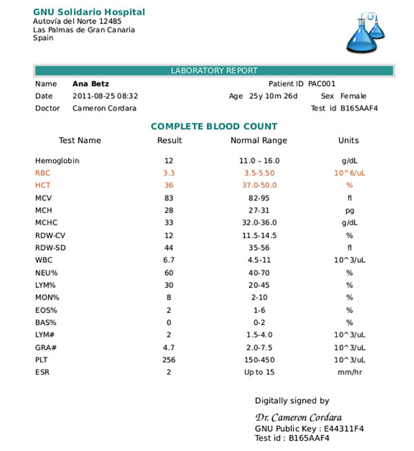
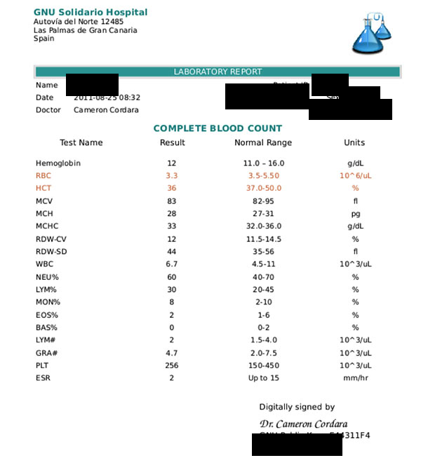
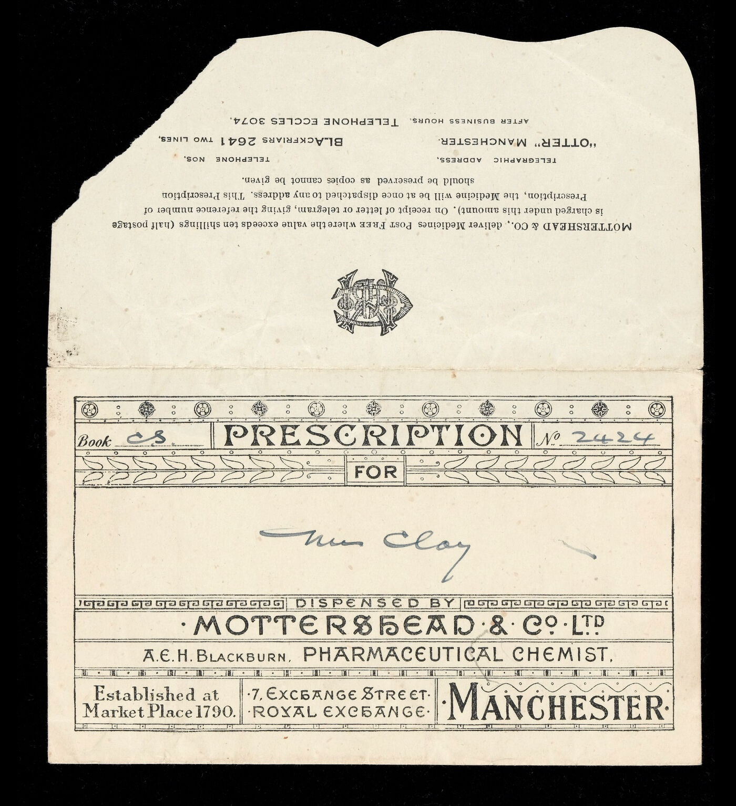
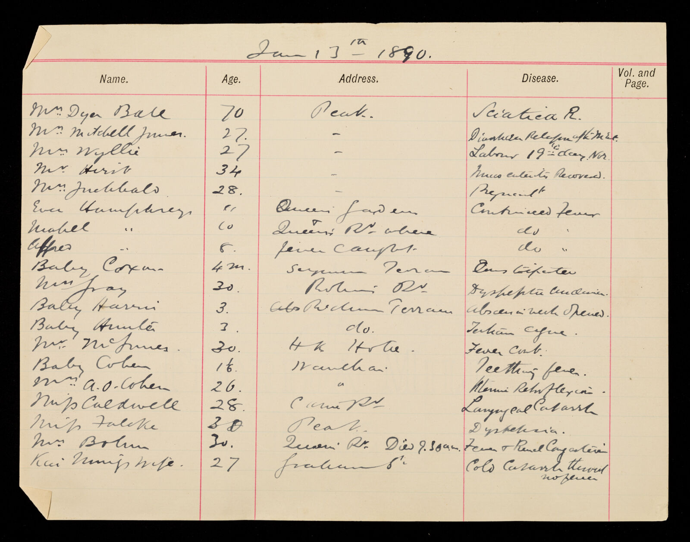

# Medical Record Privacy Redaction

**Identify and cover patient information locally while preserving useful diagnoses, laboratory results, and treatment details.**

English | [简体中文](README.zh-CN.md)

This project is designed for laboratory sheets, pathology reports, examination reports, prescriptions, and other text- or table-heavy medical documents. It uses local text recognition to locate patient identity fields, creates a new copy with opaque black masks, and checks the result again. Originals remain unchanged, and real records do not need to be sent to a public recognition service.

> This project is not a privacy certification, legal advice, or a guarantee of complete anonymity. Every document requires a final human review before external release.

## Before and after

Below are the source and actual project output for the same complete blood count report. No masks were added by hand. The project handles private text in reports, not X-rays, CT scans, or other diagnostic imagery.

| Before processing | Project output |
| --- | --- |
|  |  |

| Effect | Actual result |
| --- | --- |
| Covered | Demo patient name, patient ID, age, sex, and the test ID repeated in the header and footer |
| Residual text | The second OCR pass found none of those identity fields |
| Preserved | 18 CBC items, results, abnormal markers, normal ranges, units, report date, and doctor name |
| Manual comparison | Identity fields are covered and the laboratory body remains readable |

The asset is an MIT-licensed [ReportSenseAI test file at a fixed commit](https://github.com/MEDHANGSHI0708/ReportSenseAI/blob/fe7e800f607c873717b72072018faf36bb83ec77/MINI/uploaded_image.png). Ana Betz and GNU Solidario Hospital come from the [official GNU Health demo database](https://docs.gnuhealth.org/his/userguide/demodb.html), which is provided for academic and training use rather than as a real patient record. The local source ID is `SRC-PUBLIC-CBC-001`.

## Input-quality coverage

The English page uses English-language medical evidence only. Every showcased case is a laboratory report, prescription envelope, or prescription-book page. Chinese evaluations are documented in the [Chinese README](README.zh-CN.md). The later cross-domain section describes configurability only; it is not part of the evaluation evidence.

| Input type | Current English evidence | Result |
| --- | --- | --- |
| Standard scan or digital report | GNU Health demo CBC shown above | 9 masks, zero OCR residual detections, 18 CBC rows preserved |
| Photographed document | CC BY 4.0 photograph of an English prescription envelope | Zero masks; the upside-down handwritten patient name remained visible; routed to review |
| Handwritten document | 1890 Hong Kong Hospital patient register with names, ages, addresses, and diseases | Zero masks; the patient information remained visible; routed to review |

The photographed and handwritten rows intentionally report failures rather than inflate the success rate. A repository license or a search-result page does not prove that a modern patient consented to republication. Modern patient photographs will only be promoted to public evidence after the source, license, demo or patient status, project output, and manual comparison can all be tracked.

### Photographed document: prescription envelope

This English prescription-envelope photograph is upside down and contains a handwritten patient name. The project did not rotate it or mask the name. It did flag the irregular layout for human review, so the correct operational outcome is rejection from automatic release.

| Before processing | Project output |
| --- | --- |
|  |  |

| Evaluation item | Actual result |
| --- | --- |
| Automatic masks | 0 |
| Automatic rotation | 0 degrees; the upside-down orientation was not corrected |
| Manual comparison | The handwritten patient name remains visible |
| Final status | Mandatory human review; do not release automatically |

The source is Wellcome Collection record [Small prescription envelope for a Mr Clay](https://wellcomecollection.org/works/wr7zhrz9), licensed CC BY 4.0 and credited to Wellcome Collection. The local source ID is `SRC-PUBLIC-EN-PHOTO-001`.

### Handwritten document: patient register

This 1890 Hong Kong Hospital register is a genuine handwritten medical record with explicit privacy fields rather than a handwriting-only sample. Each row contains a patient's name and age, and many rows also contain an address and disease. The project output is shown exactly as produced: it applies no mask, so the patient information remains visible. The low-confidence handwriting is now routed to mandatory human review instead of being reported as an automatic pass.

| Before processing | Project output |
| --- | --- |
|  |  |

| Evaluation item | Actual result |
| --- | --- |
| Automatic masks | 0 |
| OCR residual count | 0, but this is not a pass because OCR did not reliably read the handwriting |
| Privacy fields in the source | Patient names, ages, addresses, and diseases |
| Manual comparison | Those patient fields remain visible; this output has not passed de-identification |
| Final status | Mandatory human review; do not release automatically |

The source is Wellcome Collection record [Register of Patients in the Hong Kong Hospital](https://wellcomecollection.org/works/rj3pbbjd), dated 1890 and licensed CC BY-NC 4.0 with credit to Wellcome Collection. The exact digitized volume and page can be tracked through the [IIIF manifest](https://iiif.wellcomecollection.org/presentation/v2/b19581841). The local source ID is `SRC-PUBLIC-EN-HANDWRITING-002`.

## What it does

- **Protects originals**: always creates a separate copy instead of overwriting source material.
- **Processes locally**: OCR, privacy decisions, masking, and rechecking can remain on the device or private network.
- **Uses irreversible masks**: applies opaque black coverage rather than recoverable blur, transparency, or removable overlays.
- **Preserves medical value**: aims to keep diagnoses, medicines, doses, laboratory values, and conclusions readable.
- **Checks outputs again**: expands coverage when residual identifiers are found or requests human review when uncertain.
- **Reviews batches**: provides a result summary, page overview, and review status for multiple files.
- **Routes risky pages**: handwriting, poor images, cropping, and abnormal layouts are not forced into an automatic pass.

## Supported material

| Material | Common examples |
| --- | --- |
| Medical document images | Phone photos of laboratory sheets, prescriptions, report screenshots, and scans |
| Multi-page reports | PDF records, examination reports, and discharge material |
| Office documents | Word records, Excel laboratory tables, and registries |
| Text material | Plain, tabular, and structured text |
| Batch collections | Folders containing several kinds of material |

## What is hidden and preserved

| Hidden by default | Preserved by default |
| --- | --- |
| Patient, relative, and contact names | Diseases, symptoms, and diagnoses |
| National identity and other document numbers | Medication, dosage, and treatment details |
| Phones, email addresses, and home addresses | Laboratory items, values, and reference ranges |
| Birth dates, employers, and bank card numbers | Specimen details, lesion sites, grades, and conclusions |
| Medical record, inpatient, outpatient, and insurance numbers | Institutions, departments, and clinicians |
| Prescription, examination, laboratory, pathology, specimen, and medical billing receipt numbers | Admission, discharge, examination, and report dates |

Preserved details can still create indirect identification risk when combined with a rare condition, institution, or date. The final policy should reflect the material's intended use and the organization's privacy requirements.

## How it works

1. **Classify the material**: determine whether it is a photo, scan, prescription, report, table, or plain text.
2. **Read locally with OCR**: extract words and page positions for precise masking.
3. **Identify private fields**: combine number formats and validation, field labels, neighboring text, row structure, and page layout.
4. **Create a redacted copy**: mask individual values where possible and use broader coverage for headers, identity rows, and uncertain regions.
5. **Recheck with OCR**: inspect the processed page again, enlarge masks when identifiers remain, and route unresolved cases to human review.
6. **Report review status**: describe categories handled and pages needing attention without repeating raw identifiers in ordinary reports.

The default approach combines local OCR, deterministic rules, and layout relationships. It does not depend on a generative large language model. This keeps decisions easier to explain and allows medical-field policies to be refined deliberately.

## Local deployment recommendations

| Use case | Suggested choice | Reason |
| --- | --- | --- |
| Clear printed Chinese documents | A small Chinese PaddleOCR model | Runs on ordinary computers with balanced speed and resource use |
| Dense text, complex tables, and poor photographs | A medium Chinese PaddleOCR model | Usually provides steadier text and position recognition but runs more slowly |
| Identity, phone, bank card, and business numbers | Format rules, validation rules, and field position | Decisions are explainable and unusual numbers are easier to flag |
| Natural-language names, addresses, and organizations | A lightweight Chinese BERT or RoBERTa entity model | Optional enhancement for expressions that fixed rules do not cover well |
| Handwriting, glare, and severe distortion | Human review as the primary safeguard | A small model should not issue an independent privacy pass |

Local workflows should also:

- Store originals, recognition intermediates, and redacted copies separately with restricted access.
- Keep raw identifiers out of ordinary audit records; store only category, position, reason, and a non-reversible fingerprint.
- Handle barcodes and QR codes separately by masking them or decoding and assessing them locally.
- Validate both required masking and required preservation on authorized real-world examples.
- Route low-quality, handwritten, cropped, tilted, or unusually masked pages to human review.
- Define retention periods for originals, intermediate files, and final results.

A larger model is not automatically safer. Stable rules, representative domain examples, output rechecking, and human review jointly determine reliability.

## Adapting it to other domains

The workflow is not limited to healthcare. Define three groups: information that must be removed, content that should remain useful, and conditions that require human confirmation. Add the relevant labels, formats, validation methods, and layout positions, and the same process can be adapted to other fields.

| Domain | Information that can be private | Information usually preserved |
| --- | --- | --- |
| Finance and insurance | Customer names, identity numbers, cards, accounts, and policy numbers | Products, value ranges, and business conclusions |
| Legal documents | Party identities, addresses, contacts, and personal case identifiers | Legal provisions, reasoning, and general case facts |
| Education | Student names, student numbers, parent phones, and home addresses | Courses, aggregate grades, and teaching feedback |
| Human resources | Employee names, staff numbers, payroll accounts, and contacts | Roles, departments, and aggregate data |
| Customer support | User accounts, phones, addresses, and personal order identifiers | Issue types, handling steps, and resolutions |

Stable document layouts usually require only a new masking, preservation, and review policy. Major differences in layout, handwriting, or specialist numbering still need corresponding layout rules and authorized evaluation examples.

## Real-layout observations

Handwriting, poor photographs, cropping, glare, and partial prior redaction are exercised as risk conditions, but they are not presented as English public evidence without an authorized English source. Clear printed reports remain the strongest automated path; handwritten and incomplete documents remain review-first.

## Material provenance

| Source ID | Material | Permission and use |
| --- | --- | --- |
| `SRC-PUBLIC-CBC-001` | A GNU Health demo CBC report in ReportSenseAI | MIT; suitable for public display and tracking |
| `SRC-PUBLIC-EN-PHOTO-001` | Wellcome Collection English prescription-envelope photograph | CC BY 4.0; public failure-case display and tracking permitted |
| `SRC-PUBLIC-EN-HANDWRITING-002` | Wellcome Collection 1890 Hong Kong Hospital patient register | CC BY-NC 4.0; non-commercial failure-case display and tracking permitted |

The public CBC source file is fixed to ReportSenseAI commit `fe7e800f607c873717b72072018faf36bb83ec77` and was accessed on August 22, 2026. Its source SHA-256 is `700648e4c367ac42a84f3c48123c3daf1aa85114b984aab7752cf4be1523ebb3`; the project output SHA-256 is `379dff3994538c5aa155c988a71ca0649e4a56f349a866688914c287aa3bbda2`. The source ID, fixed commit, and hashes make the material and result independently traceable.

The English photographed source is Wellcome Collection work `wr7zhrz9`; its source SHA-256 is `d2bc3951954dbacd0188ae44659daae319aa028dfd2a8aaf26875edbf16ca875` and project-output SHA-256 is `58757f12e4afaf91202bfdbb78b9d589285f73dbce2f40e691f546eb7b5ba89a`. The handwritten register is work `rj3pbbjd`, digitized volume `b19581841`, page `b19581841_MS_1469_0002.jp2`; its source SHA-256 is `77662f3dd25d776d3c62870bd267e88261369ba0f547a05c6d26bdbca070034f` and output SHA-256 is `73f3cbd4dbbbfa3e905bd0657d2983d0b148af98857a23b2272eaef816d2837d`. Both were accessed on August 22, 2026. Modern English patient photographs remain in protected review until their reuse rights and identity provenance are verified.

## Human review is required

- Handwriting, signatures, stamps, or poor-quality photographs
- Tilt, rotation, perspective distortion, glare, or partial obstruction
- Faces, portraits, fingerprints, and other non-text identifiers
- Barcodes or QR codes that may encode patient numbers
- Cropped pages without enough field labels or context
- Rare conditions, dates, and institutions that may identify someone in combination
- Any result explicitly marked for review

Before external release, inspect every page's text, image edges, barcodes, QR codes, filename, and metadata.

## License

This project is available under the [MIT License](LICENSE). The license applies to the project itself and does not grant permission to redistribute evaluation materials.
