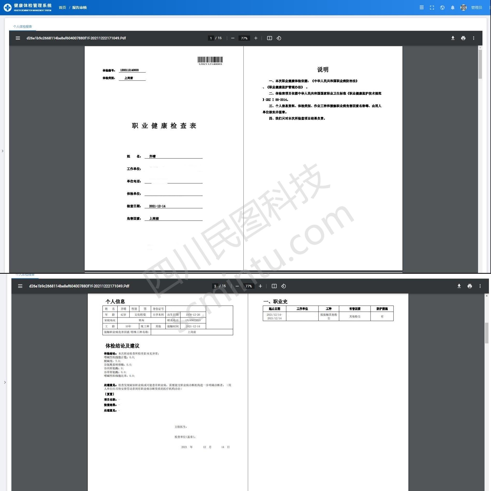
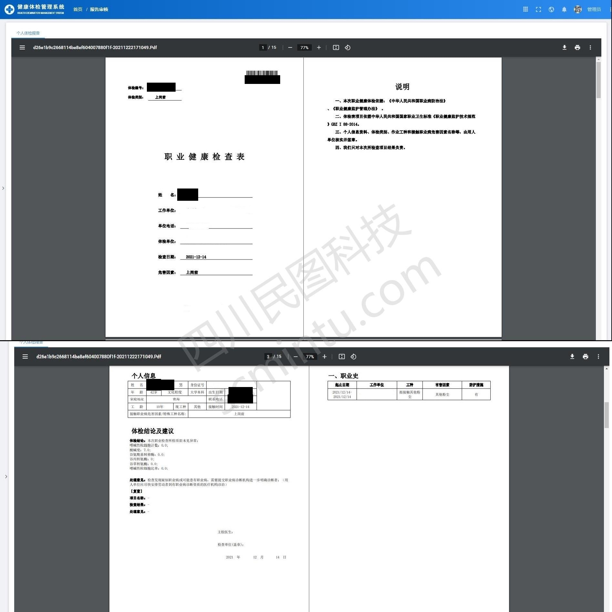
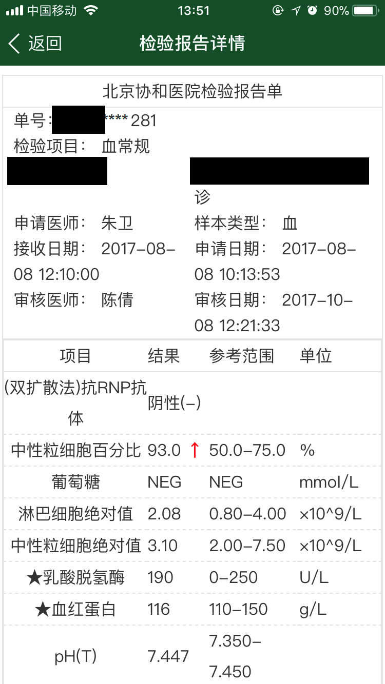
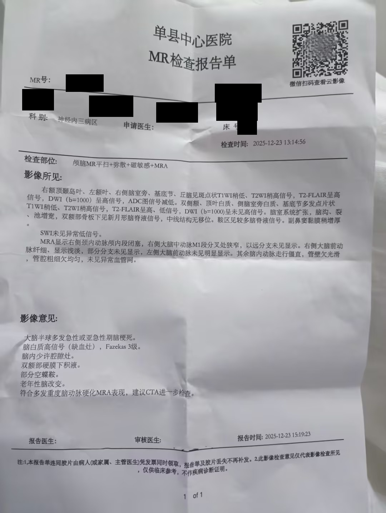

# 医疗病历隐私遮挡

**在本地识别并遮挡患者身份信息，同时尽量保留诊断、检验和治疗内容。**

[English](README.md) | 简体中文

这个项目面向检验单、化验单、病理报告、检查报告、处方和其他以文字或表格为主的医疗文档。它通过本地文字识别找到患者身份字段，生成使用不透明黑块遮挡的新副本，并再次检查处理结果。原件不会被改写，真实材料不需要上传到公共识别服务。

> 本项目不是医疗隐私合规认证，也不构成法律意见或完全匿名保证。任何材料对外分享前，都应完成最终人工复核。

## 中文效果案例

中文页只使用中文医疗材料，所有效果案例均来自体检报告、检验单或处方等医疗文书。当前已有标准电子报告案例和手机拍照受控评测；英文手写患者登记簿案例见 [English README](README.md)。“迁移到其他领域”只说明这套方法的可配置性，不属于效果案例或测评结果。

### 标准电子报告：职业健康检查表

下面是同一份中文职业健康检查表的公开教学截图和本项目实际输出。黑块全部由项目生成，没有手工补画。

| 处理前 | 本项目处理后 |
| --- | --- |
|  |  |

| 评估项 | 实际结果 |
| --- | --- |
| 自动遮挡 | 7 处，覆盖姓名、电话、出生日期、体检编号和条码下编号 |
| 处理后残留 | 二次 OCR 未检出上述身份字段 |
| 内容保留 | 职业史、体检结论、检查日期和说明文字保持可读 |
| 最终状态 | 需要人工复核；原图由两张报告页拼接，版面结构不规则 |

素材来自 LGPL-3.0 许可的 [healthyCheckUi 固定版本功能截图](https://github.com/scmt1/healthyCheckUi/blob/c6b50346993f7e8debdc567e3469b8fa74eaaafb/vx_images/206350912225539.jpg)。上游说明截图来自已完成功能，并允许个人学习和教学案例；页面内容按系统演示材料处理。项目内来源编号为 `SRC-PUBLIC-CN-OCCUPATIONAL-001`。

### 手机拍照：中文血常规化验单

一张倾斜、光照不均的中文血常规照片已完成受控评测。项目生成 11 处遮挡，覆盖患者姓名、门诊号、身份表头和医疗收费票据号；二次 OCR 残留为 0，22 项血常规结果、参考范围、单位、医务人员和日期保持可读。

人工对照发现，第一次处理漏掉了页面上的收费票据号，同时把“送检医生”误当成患者姓名。规则修正并重新处理后，票据号已覆盖，医务人员字段得到保留。这个案例说明拍照件不能只看自动复检，必须同时检查漏遮挡和误遮挡。

素材来自 Apache-2.0 项目 [BloodTestReportOCR 的固定版本测试图](https://github.com/csxiaoyaojianxian/BloodTestReportOCR/blob/95d058e4999806fa50bbcf6d10fe8a0af5746759/BloodTestReportOCR/origin_pics/bloodtestreport2.jpg)，来源编号为 `SRC-OPEN-CBC-UNVERIFIED-001`。由于患者公开授权无法核实，仓库不复制带身份信息的原图，也不把该案例包装成可自由传播的公开演示。

### 标准电子报告：北京协和医院检验单

这是你提供的北京协和医院检验报告截图。原图中可见患者姓名、部分单号、申请科室、申请医生和审核医生。项目实际输出遮挡了患者姓名和单号，检验项目与结果仍然可读；人工检查发现申请科室被一并遮挡，因此不是“零误遮挡”的通过案例。

| 处理前 | 本项目处理后 |
| --- | --- |
|  |  |

| 评估项 | 实际结果 |
| --- | --- |
| 自动遮挡 | 4 处，包含姓名、单号和身份信息行 |
| 处理后残留 | 二次 OCR 未检出规则命中的身份字段 |
| 人工对照 | 姓名和单号已覆盖；申请科室被误遮；医生姓名保留 |
| 最终状态 | 必须人工复核，不能直接对外发布 |

来源页面是 [北京协和医院报告查询](https://www.pumch.cn/reportquery.html)，原始图片地址固定为上面的 PNG 链接。该站点没有在图片附近明确授予再发布许可，仓库只提交项目输出，不把原图复制为 MIT 项目资产。来源编号为 `SRC-CONTROLLED-CN-PUMCH-LAB-001`。原图 SHA-256 为 `bc990c967a9fec9e7aafc86b1c7aa5e08adcfeba35e0d3093fa3ce71e3cf4547`，项目输出 SHA-256 为 `fea8b59940b045445052d098b19f3a1a7eae73e2a6b18d82a8be0b6a6536f695`。

### 手机拍照并有明显折痕：MR 检查报告单

这张 TextIn 医疗报告示例是手机拍摄的折痕文字报告单，不是 MR 影像。它包含 MR 号、病人 ID 栏、年龄、住院号、床号和二维码。姓名栏本身已经为空，因此它不能评价姓名召回，但适合测试折痕、反光、编号和二维码风险。项目遮挡了 MR 号、年龄、住院号、床号等字段，保留了检查所见和影像意见；二维码仍保留，必须人工确认是否需要单独处理。

| 处理前 | 本项目处理后 |
| --- | --- |
|  |  |

| 评估项 | 实际结果 |
| --- | --- |
| 自动遮挡 | 7 处，包含 MR 号、年龄、住院号和床号相关区域 |
| 处理后残留 | 二次 OCR 未检出规则命中的字段 |
| 人工对照 | 折痕和二维码仍需检查，部分身份行遮挡范围偏宽 |
| 最终状态 | 触发版面异常人工复核，不可自动发布 |

素材来自 TextIn 的 [医疗报告抽取示例页](https://www.textin.com/tasks/medical-report-extraction)，原始图片地址固定为上面的 JPG 链接。页面未明确授予图片再发布许可，仓库只提交项目输出。来源编号为 `SRC-CONTROLLED-CN-TEXTIN-FOLDED-001`。原图 SHA-256 为 `817ee7f7181a545b083bc47e06b374cad115a7bc3fab0b2bd135350e62f0d80d`，项目输出 SHA-256 为 `7fad0bd5f67d3a1f5b5fb0a7f86c251b7871ffe36fe9a8a48551d1cfbc5c34ce`。

### 候选素材评估：扬子晚报拍照检验单

你提供的扬子晚报图片已经由原发布方用箭头、方框和模糊处理遮住了姓名、就诊卡号、住院号等身份字段，因此不适合作为“原始隐私信息召回”案例。项目在这张图上仍产生 14 处遮挡，人工查看发现检验结果、参考范围和正文也被大面积误遮。它只说明“已经被处理过的公开图片不能直接当作测试集”，不纳入效果展示。

来源编号为 `SRC-CONTROLLED-CN-YANGTSE-001`。原始图片地址为你提供的 [imgcdn.yzwb.net 图片链接](https://imgcdn.yzwb.net/181_1738735693000.jpg?imageMogr2/thumbnail/1080x%3E/strip/ignore-error/1%7Cimageslim)，来源页面为 [扬子晚报新闻页](https://m.yangtse.com/news_details.html?id=4308066)。原图 SHA-256 为 `d47503a271f9d5c65cb8334e5bc1b8d737b988f3e0b576e1e1dbf6e5f4de6d69`；由于原图已经预先打码，不能据此宣称姓名去除率。

### 中文手写案例：暂不冒充有效测评

此前展示的中文手写处方没有患者姓名、就诊号、电话或地址，无法验证隐私字段能否被遮挡，因此已从效果案例中撤下。它最多只能测试 OCR 是否会误遮药名，不能回答“手写患者信息是否被去除”。

目前还没有找到同时满足以下条件的中文手写医疗原图：图中确有可验证的患者隐私字段；素材来源和具体页面可追踪；患者授权或历史馆藏的再发布许可清晰。在找到合格素材前，中文手写栏不公布遮挡效果，也不以二次 OCR 的“残留 0”声称成功。英文页已经加入多份含患者姓名、年龄、地址、职业和疾病的历史医院登记簿与病例页，分别展示完整姓名列遮挡、部分遮挡和失败结果。

## 能做什么

- **保护原件**：始终创建独立副本，不覆盖原始材料。
- **本地处理**：文字识别、隐私判断、遮挡和复检均可留在本机或内网。
- **不可逆遮挡**：使用不透明黑块，不依赖可能被恢复的模糊、透明层或页面浮层。
- **保留医疗价值**：尽量保留诊断、药物、剂量、检验结果和检查结论。
- **处理后复检**：再次读取输出，发现残留时扩大遮挡或提示人工检查。
- **批量材料审核**：处理多份文件后提供结果摘要、页面总览和复核提示。
- **风险分流**：手写、低清、裁剪和版面异常材料不会被强行判定为安全。

## 支持的材料

| 材料 | 常见例子 |
| --- | --- |
| 医疗文档图片 | 手机拍摄的检验单、化验单、处方、报告截图和扫描件 |
| 多页报告 | PDF 病历、检查报告、出院材料 |
| 办公文档 | Word 病历、Excel 检验表和登记表 |
| 文本材料 | 普通文本、表格文本和结构化文本 |
| 批量资料 | 一个文件夹中的多份不同材料 |

## 遮挡与保留边界

| 默认遮挡 | 默认保留 |
| --- | --- |
| 患者姓名、联系人和家属姓名 | 疾病、症状和诊断结论 |
| 身份证号和其他证件号码 | 药品、剂量和治疗信息 |
| 电话、邮箱和家庭地址 | 检验项目、数值和参考范围 |
| 出生日期、工作单位和银行卡号 | 标本、病灶位置、分级和检查结论 |
| 病案号、住院号、门诊号和医保号 | 医院、科室和医务人员姓名 |
| 处方号、检查号、检验单号、病理号、样本号和医疗收费票据号 | 入院、出院、检查和报告日期 |

保留项在特定场景中仍可能与罕见疾病、机构或日期组合形成间接识别风险。最终遮挡范围应根据材料用途和组织政策决定。

## 处理逻辑

1. **识别材料类型**：判断是照片、扫描件、处方、报告、表格还是普通文本。
2. **本地 OCR 阅读**：读取页面文字及其位置，为后续遮挡提供坐标。
3. **判断隐私字段**：结合号码格式和校验、字段名称、相邻文字、所在行及页面布局判断哪些内容需要移除。
4. **生成遮挡副本**：正文尽量只遮挡具体隐私值；表头、身份行和不确定区域采用更保守的范围。
5. **再次 OCR 复检**：重新检查处理后的页面；发现残留时继续扩大遮挡，无法确认时进入人工复核。
6. **输出审核结果**：说明处理了哪些类别、哪些页面仍有风险，同时避免在普通记录中重复保存原始身份值。

当前默认方案是本地 OCR 加确定性规则和版面关系，不依赖生成式大模型。这样更容易解释每一处遮挡的原因，也便于针对具体医疗字段持续补充规则。

## 本地化部署建议

| 使用场景 | 建议选择 | 原因 |
| --- | --- | --- |
| 清晰的中文印刷件 | PaddleOCR 小型中文模型 | 普通电脑可运行，速度和资源占用较平衡 |
| 密集小字、复杂表格和低清照片 | PaddleOCR 中型中文模型 | 文字和位置识别通常更稳定，但处理更慢 |
| 身份证、电话、银行卡和业务编号 | 格式规则、校验规则和字段位置 | 判断容易解释，也便于发现异常号码 |
| 姓名、地址和单位等自然语言 | 轻量中文 BERT 或 RoBERTa 实体识别模型 | 可作为增强能力，补充固定规则难以覆盖的表达 |
| 手写、强反光或严重变形材料 | 人工复核为主 | 小模型不应独立给出安全结论 |

本地化处理还应注意：

- 原件、识别中间结果和遮挡副本分开存放，并限制访问权限。
- 普通审核记录不保存原始隐私值，只记录类别、位置、判断依据和不可反推的指纹。
- 条码和二维码单独处理；对外发布时应遮挡，或先在本地解码确认内容。
- 使用经过授权的真实业务样本验证“该遮挡的是否遮挡、该保留的是否保留”。
- 低清、手写、裁剪、严重倾斜或遮挡范围异常的页面自动进入人工复核。
- 按实际用途设置原件、中间文件和结果文件的保留期限。

模型越大不代表越安全。稳定规则、真实领域样本、处理后复检和人工审核共同决定最终可靠性。

## 迁移到其他领域

这套流程不局限于医疗材料。核心是定义三类信息：必须去掉的隐私、业务上需要保留的内容，以及必须人工确认的情况。再补充对应的字段名称、格式、校验方式和版面位置，即可迁移到其他领域。

| 领域 | 可以配置为隐私的信息 | 通常希望保留的信息 |
| --- | --- | --- |
| 金融与保险 | 客户姓名、证件号、银行卡、账号和保单号 | 产品、金额区间和业务结论 |
| 法律材料 | 当事人身份、住址、联系方式和个人案号 | 法律条款、裁判理由和通用案情 |
| 教育 | 学生姓名、学号、家长电话和家庭地址 | 课程、成绩统计和教学反馈 |
| 人力资源 | 员工姓名、工号、薪资账号和联系方式 | 岗位、部门和汇总数据 |
| 客服与工单 | 用户账号、电话、地址和订单标识 | 问题类型、处理过程和解决结论 |

文件结构稳定时，通常重新配置遮挡、保留和复核规则即可复用主要流程。版式、手写比例或专业编号差异较大时，还需要增加相应的布局判断和授权测试样本。

## 版式适应性观察

除上面的完整案例外，项目还在 6 张中文医疗文书上做了版式观察，素材均为处方或裁剪化验单。清晰印刷件更适合自动处理；两张字迹密集或拍摄条件较差的材料进入了人工复核；已经局部遮挡或裁剪的图片仍可能在边缘和其他编号中留下风险。

这组材料没有完整的逐字段人工标注，也缺少足以支持再次公开原图的授权，因此不用于公布准确率，也不作为视觉广告案例。

## 素材来源与追踪

| 来源编号 | 素材 | 授权与用途 |
| --- | --- | --- |
| `SRC-PUBLIC-CN-OCCUPATIONAL-001` | healthyCheckUi 中文职业健康检查表 | LGPL-3.0，上游允许学习和教学案例，可公开展示和追踪 |
| `SRC-OPEN-CBC-UNVERIFIED-001` | BloodTestReportOCR 中文血常规拍照件 | 项目为 Apache-2.0，但患者授权无法核实，仅限受控评测 |
| `SRC-REAL-PATHOLOGY-001` | 公开网页中的中文病理报告照片 | 转载和患者授权无法核实，仅限隔离评测 |
| `SRC-CONTROLLED-CN-PUMCH-LAB-001` | 北京协和医院检验报告截图 | 原站未明确授予图片再发布许可，仅保留项目输出和来源链接 |
| `SRC-CONTROLLED-CN-TEXTIN-FOLDED-001` | TextIn 折痕 MR 检查报告示例 | 页面未明确授予图片再发布许可，仅保留项目输出和来源链接 |
| `SRC-CONTROLLED-CN-YANGTSE-001` | 扬子晚报预先打码的拍照检验单 | 原图已有编辑遮挡且项目误遮明显，只作候选素材排除记录 |

公开职业健康检查表固定在 healthyCheckUi 提交 `c6b50346993f7e8debdc567e3469b8fa74eaaafb`，获取日期为 2026 年 8 月 22 日。仓库内处理前文件指纹为 `92a716af0c62ede83854b09e775cfa99eaddfa962558cc7da363e3482bb3ea33`，处理后文件指纹为 `34ca89dc781aeebd70127282c379bcc06f9d3c33698756292a1cc150e4c38db1`。

受保护的来源台账保存网页地址、固定版本、获取日期、文件指纹、授权状态和对应结果。无法确认患者授权的材料不会把原图或原始身份信息收入仓库。

## 必须人工复核

- 手写内容、签名、印章或低清晰度照片
- 倾斜、旋转、透视变形、反光或部分遮挡
- 人脸、头像、指纹等非文字身份信息
- 可能编码患者编号的二维码和条码
- 页面被裁剪，无法确认字段名称或上下文
- 罕见疾病、日期和机构组合可能间接识别患者
- 处理结果明确提示需要复核

对外发布前，应同时检查每一页的文字、图片边缘、条码、二维码、文件名和附加信息。

## 许可

本项目采用 [MIT License](LICENSE)。许可只适用于项目本身，不代表测试素材可以转载或重新发布。
